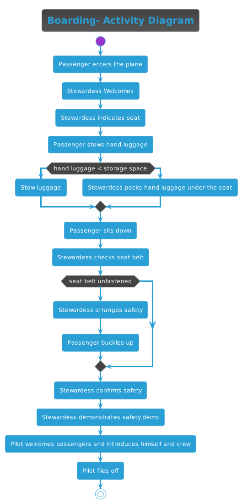

# Activity-diagram
## Creating Activity diagrams with puml

PlantUML (PUML) is a tool that allows users to create diagrams from plain text descriptions, making it ideal for easily generating and maintaining various types of UML diagrams, flowcharts, and other visual representations of systems and processes.

You can create UML diagrams in your IDE or you could use the open source editor online. When you want to try it in your IDE you need a plugin for e.g. **PlantUML Integration**, so that you can see a diagram as a preview as you create it.

**diagram.puml**
```
@startuml
!theme cyborg


title Boarding- Activity Diagram


start

:Passenger enters the plane;

:Stewardess Welcomes;

:Stewardess indicates seat;

:Passenger stows hand luggage;

if (hand luggage < storage space) then (yes)
  :Stow luggage;
else (no)
  :Stewardess packs hand luggage under the seat;
endif

:Passenger sits down;

:Stewardess checks seat belt;
if (seat belt unfastened) then (yes)
  :Stewardess arranges safety;
  :Passenger buckles up;

endif;
:Stewardess confirms safety;
:Stewardess demonstrates safety demo;
:Pilot welcomes passengers and introduces himself and crew;
:Pilot flies off;

stop
@enduml
```

**Output:**

.
